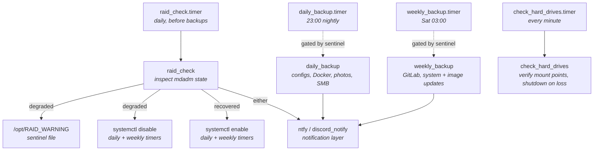

# server-backup

A layered backup and watchdog system for a homelab server. Daily and
weekly Bash scripts back up configuration files, Docker volumes, and
user data via rsync; a separate watchdog inspects mdadm RAID state on
its own timer and disables the backup timers when an array is degraded,
re-enabling them automatically once the array recovers. A mount-loss
watcher shuts the server down before backups can write to a missing
volume. Notifications go out over Discord and ntfy through a small
shared transport layer.

> **Note:** this is a sanitized mirror of a real homelab system. Personal
> usernames, hostnames, and domain names have been generalized for public
> release; Discord webhook URLs have been refactored out of source and
> are loaded from an env file in production. The scripts, systemd units,
> and state-machine logic are otherwise unchanged from what's running
> live.

## Architecture



The pieces are loosely coupled by design: each script is its own
systemd service with its own timer, and they communicate through a
combination of sentinel files (`/opt/RAID_WARNING`), systemctl
enable/disable calls, and the shared `ntfy` / `discord_notify`
transport. Failure in one component does not block the others.

## What this demonstrates

- Defensive operations design: backups don't run blind, they're gated on
  the health of the underlying storage
- State-machine behavior in shell — `raid_check` writes a sentinel on
  failure, detects the sentinel on the next run, and reverses its own
  side effects when the array recovers
- Composable systemd service + timer pairs, each with appropriate
  scheduling (`OnCalendar` for nightly/weekly, `OnUnitActiveSec` for the
  per-minute mount watcher)
- Docker-aware backups that bring containers down cleanly around the
  rsync window and restart them after, per service
- Secrets handled out of source — `discord_notify` reads webhook URLs
  from `/etc/discord_notify.env` rather than hardcoding them
- A unified notification layer (`ntfy` → `discord_notify`) that any
  script can call without knowing about webhooks, message formatting,
  or escaping
- Real recovery thinking: mount-loss triggers a shutdown rather than
  letting backups silently fill the root filesystem; the manual
  `dvd_backup` exports everything critical to a single portable tarball
  for off-site cold storage

## Layout

```
.
├── raid_check                       # RAID watchdog, gates downstream timers
├── raid_check.service               # systemd unit for the watchdog
├── raid_check.timer                 # daily, runs before the backup timers
│
├── daily_backup                     # rsync backup: configs, Docker, photos, SMB
├── daily_backup.service             # systemd unit
├── daily_backup.timer               # 23:00 nightly, with jitter
│
├── weekly_backup                    # GitLab backup, docker pull/up, dnf update
├── weekly_backup.service            # systemd unit
├── weekly_backup.timer              # Saturday 03:00
│
├── check_hard_drives                # mount-loss watcher; shuts down on miss
├── check_hard_drives.service        # systemd unit
├── check_hard_drives.timer          # every minute
│
├── dvd_backup                       # manual disaster-recovery export
│
├── ntfy                             # message normalizer (CLI args or stdin)
├── discord_notify                   # Discord webhook transport, env-driven
├── ntfywd                           # one-liner: ntfy "a task has finished"
│
├── nvidia_driver_check              # alert on pending reboot (driver-aware)
├── reboot_check                     # alert on pending reboot (general)
│
├── .gitignore
└── discord_notify.env.example       # template for /etc/discord_notify.env
```

## Components

### `raid_check`

The piece that makes this more than a backup script. Reads `/proc/mdstat`,
runs `mdadm --detail` against each active array, and looks for `degraded`,
`resyncing`, or `recover` in the state line.

**When something is wrong:**

- Writes `/opt/RAID_WARNING` as a persistent sentinel
- Disables `daily_backup.timer` and `weekly_backup.timer` via systemctl
- Pages via ntfy with the actual `mdadm --detail` output (specifically
  the `State`, `Active Devices`, and `Failed Devices` lines)
- Sends a second notification confirming the backups are disabled

**When the array recovers** (next run finds healthy state plus an existing
sentinel):

- Removes `/opt/RAID_WARNING`
- Re-enables both backup timers
- Logs the recovery

The script holds two pieces of state — the live array state and whether
it was already in a warning condition when this run started — so re-runs
converge correctly regardless of the order failures and recoveries happen
in. There's also a `raid_check_test=true` flag at the top that flips the
healthy path into "send a notification confirming the check passed,"
useful for verifying the alerting path works end-to-end without breaking
an array.

### `daily_backup`

Runs at 23:00 with a 5-minute randomized delay (`RandomizedDelaySec=5m`).
Eight stages, each piped through `tee -a` to a shared log:

1. **Config files** — `/etc/samba/smb.conf`, `/etc/snmp/snmpd.conf`,
   `/etc/rsyslog.conf`
2. **rsyslog drop-ins** — the whole `/etc/rsyslog.d` directory
3. **Custom scripts** — everything in `/usr/local/bin/`
4. **systemd units** — everything in `/etc/systemd/system/`
5. **Docker volumes** — for each service under `/opt/storage/docker/`,
   `docker compose down`, rsync the directory, `docker compose up -d`.
   Containers stop cleanly so volumes are consistent at the rsync moment
6. **Photos** — Nextcloud user photo directories
7. **Samba shares** — `/opt/storage/smb`
8. **Notify + reboot check** — Discord notification, then check whether
   `dnf needs-restarting -r` indicates a pending reboot and alert if so

Every rsync uses `-aAXv --delete` so ACLs and extended attributes
survive and the target stays a true mirror.

### `weekly_backup`

Runs Saturday at 03:00. Four stages, each logged to its own file under
`/var/log/update_logs/`:

1. **GitLab native backup** — `gitlab-backup` plus a `gitlab-ctl backup-etc`
   of the configuration directory, copied into the GitLab backups volume
2. **Docker image updates** — `compose pull` + `down` + `up -d` for each
   service in `/opt/storage/docker/`
3. **System update** — `dnf update -y`
4. **Image prune** — `docker system prune -f` to reclaim space from the
   now-stale image layers

Runs on top of `daily_backup`, not instead of it. Notifies via ntfy when
finished.

### `check_hard_drives`

Runs every minute via `OnUnitActiveSec=1min`. Verifies that `/opt/storage`
and `/opt/backup` are still mount points (not just empty directories
that the filesystem fell back to when an underlying device vanished).
If either is missing, it disables its own timer and triggers
`/sbin/shutdown -h now`.

The order matters — if you shut down without disabling the timer first,
the timer fires again on next boot and shuts you back down. So the
script disables-then-shuts, and only shuts if the disable succeeded.

### `dvd_backup`

Manual, not scheduled. Pulls together a single tarball of everything
needed to rebuild the server from scratch — docker-compose files, env
files, named.conf and zone files for BIND9, NPM reverse proxy config,
LibreNMS configuration, Vaultwarden volumes, Samba/SNMP system configs,
custom scripts, and systemd units. Writes to a Samba share for transfer
to portable media. `chmod 600` and `chown` to the configured owner so
nobody but the owner can read the resulting tarball.

The closing message — `dont forget to encrypt this bad boy :)` — is a
nudge to apply LUKS or a `gpg --symmetric` on the tarball before it
leaves the network.

### `ntfy` and `discord_notify`

`discord_notify` is the bottom of the stack. It reads
`/etc/discord_notify.env`, which must define `<channel>_url` variables
(e.g. `homelab_server_url`, `schedule_bot_url`), and POSTs the message
to the matching webhook. The env file lives outside the repo and the
script refuses to run if it's missing. `set -euo pipefail` keeps a
missing variable or a failed curl from being silently swallowed.

`ntfy` is the wrapper most scripts call. It takes a message either as
arguments or on stdin, escapes embedded newlines into `\n` so the JSON
payload stays valid, and hands the result to `discord_notify` with a
fixed channel name. The split exists so callers don't have to think
about webhook routing — every script can just say `ntfy "message"`.

### `nvidia_driver_check`, `reboot_check`, `ntfywd`

Small focused utilities. `reboot_check` and `nvidia_driver_check` look
for `/var/run/reboot-required` and notify if found; the second one is
named for the driver-update path on systems where that file is set by
the NVIDIA driver post-install hook. `ntfywd` is a one-liner that fires
a "task finished" notification — useful as an `&&` tail on long-running
manual commands.

## Configuration

### Webhook URLs

Create `/etc/discord_notify.env` from the example file:

```bash
sudo cp discord_notify.env.example /etc/discord_notify.env
sudo chmod 600 /etc/discord_notify.env
sudo chown root:root /etc/discord_notify.env
sudo $EDITOR /etc/discord_notify.env  # fill in real webhook URLs
```

Variable names must match the channel names the scripts pass — by
default `homelab_server` (used by `ntfy` and `daily_backup`).

### Storage paths

The scripts assume the following exist and are writable by root:

- `/opt/storage/` — primary data (Docker volumes, Samba, Nextcloud)
- `/opt/backup/` — backup destination
- `/var/log/update_logs/` — log destination
- `/opt/RAID_WARNING` — sentinel file location (created by the watchdog)

Change them at the top of each script if your layout differs.

### Installation

Copy the scripts into `/usr/local/bin/` and the units into
`/etc/systemd/system/`, then enable the timers you want active:

```bash
sudo install -m 755 daily_backup weekly_backup raid_check \
    check_hard_drives dvd_backup ntfy discord_notify ntfywd \
    nvidia_driver_check reboot_check /usr/local/bin/

sudo install -m 644 *.service *.timer /etc/systemd/system/

sudo systemctl daemon-reload
sudo systemctl enable --now raid_check.timer daily_backup.timer \
    weekly_backup.timer check_hard_drives.timer
```

`raid_check.timer` should be enabled first so that the gating logic is
already active when the first backup window arrives.

## Notes

- Targets RHEL-family Linux (the scripts use `dnf` for system updates and
  pending-restart checks). Adapt the package manager calls if running on
  Debian/Ubuntu
- `check_hard_drives` runs every minute, which is aggressive but cheap —
  the check is two `mountpoint` calls. The cost of catching a vanished
  mount one minute later instead of one second later would be backups
  silently writing to the root filesystem until the next scheduled run
- The `dvd_backup` script lists specific Docker services (bind9, dashy,
  gitlab, nextcloud, nginx-proxy-manager, librenms, vaultwarden) because
  each one has its own set of files-worth-backing-up that aren't covered
  by the volume rsync alone. Adjust the `copy_special_docker_files`
  function to match your own stack
- `raid_check_test=true` at the top of `raid_check` flips the script
  into "notify on healthy too" mode — useful for end-to-end verification
  of the notification path. Leave it `false` in production
